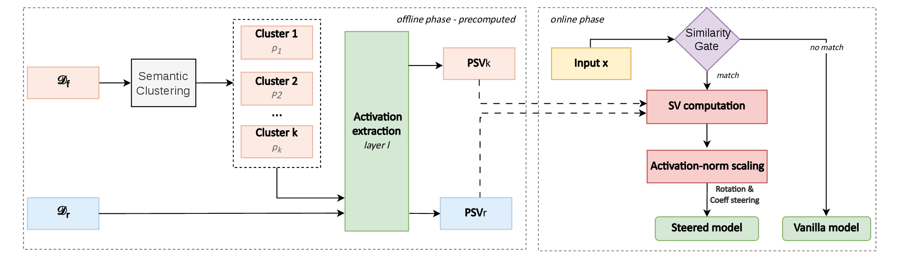

# GUARD-IT

**Inference-Time Unlearning via Gated Activation Redirection**

This repository is the official implementation of [GUARD-IT: Inference-Time Unlearning via Gated Activation Redirection](PAPER_LINK).



GUARD is **training-free**: it computes per-cluster steering vectors from a forget corpus via a single forward pass and applies them at inference time through a cosine-similarity gate that routes each input to the most relevant cluster's vector — or passes through unmodified if no cluster matches.

---

## Requirements

```bash
conda create -n guard python=3.12
conda activate guard
pip install -e ".[tofu,gateway]"
```

Optional extras: `quant` (4-bit/8-bit quantization), `dev` (tests + linting).

---

## Methods

| Method | Description |
|--------|-------------|
| `orthogonal` | Project forget mean perpendicular to retain mean direction |
| `diff_means` | `forget_mean − retain_mean` |
| `orth_diff_means` | `diff_means` then projected perpendicular to retain |

**Normalizations** (both enabled by default):
- `activation_norm` — scales SV to match corpus activation norms → model-agnostic coefficients
- `rotation_only` — rotation-only steering at eval: preserves hidden-state magnitude

---

## Steering Vector Computation

No gradient updates are involved. This step extracts activations from the forget corpus in a single forward pass and computes clustered steering vectors. Ready-to-use configs are in [`configs/examples/`](configs/examples/):

| Config | Model | Split |
|--------|-------|-------|
| `tofu_1b_forget01.yaml` | Llama-3.2-1B | forget01 |
| `tofu_1b_forget05.yaml` | Llama-3.2-1B | forget05 |
| `tofu_1b_forget10.yaml` | Llama-3.2-1B | forget10 |
| `tofu_3b_forget01.yaml` | Llama-3.2-3B | forget01 |
| `tofu_3b_forget05.yaml` | Llama-3.2-3B | forget05 |
| `tofu_3b_forget10.yaml` | Llama-3.2-3B | forget10 |
| `tofu_8b_forget01.yaml` | Llama-3.1-8B | forget01 |
| `tofu_8b_forget05.yaml` | Llama-3.1-8B | forget05 |
| `tofu_8b_forget10.yaml` | Llama-3.1-8B | forget10 |
| `muse_books.yaml` | MUSE-books | Harry Potter |
| `muse_news.yaml` | MUSE-news | BBC News |

```bash
guard cluster configs/examples/tofu_1b_forget05.yaml
```

Or write a minimal config:

```yaml
model_name: open-unlearning/tofu_Llama-3.2-1B-Instruct_full
layers: [4]
method: orthogonal
dataset:
  type: tofu
  forget_split: forget05
```

```bash
guard cluster my_config.yaml --n-clusters auto
guard cluster my_config.yaml --override layers=[4,8,12] --override cuda=0
```

Output:
```
steering_vectors/<model>/orthogonal_clustered/forget05_Kf<K>_s0/residual/layer_4/
  psv_clusters.pt      — [K, H] per-cluster Partial Steering Vectors
  centroids.pt         — [K, H] per-cluster LLM activation centroids
  text_centroids.pt    — [K, D] MiniLM centroids for routing
  routing_threshold.json
  cluster_meta.json
```

### Picking a routing threshold

Plot the cosine-similarity distribution of your corpus against the forget cluster centroids:

```bash
guard plot similarity configs/examples/tofu_1b_forget05.yaml --threshold 0.55
```

The plot shows forget, retain, and FineWeb-Edu distributions. Choose the threshold where the forget distribution is well above it and retain/general are well below.

```bash
# From any HuggingFace dataset (no config file needed):
guard plot similarity \
    --hf-dataset locuslab/TOFU \
    --hf-forget-split forget05 \
    --hf-retain-split retain95 \
    --threshold 0.55

# Options:
#   --n-clusters K       number of forget clusters (default: 10)
#   --fineweb-n N        FineWeb-Edu reference sample size, 0 to disable (default: 5000)
#   --out PATH           output PNG/PDF path
```

---

## Evaluation

The benchmarks depend on external repos that must be cloned manually:

```bash
# TOFU — clone open-unlearning into benchmarks/open-unlearning/
git clone https://github.com/locuslab/open-unlearning.git benchmarks/open-unlearning
pip install -e "benchmarks/open-unlearning[tofu]"

# MUSE — clone muse_bench as a sibling of the guard repo
git clone https://github.com/swj0419/muse_bench ../muse_bench
pip install -r ../muse_bench/requirements.txt  # or use its environment.yml
```

Then run:

```bash
# TOFU
guard cluster configs/examples/tofu_1b_forget05.yaml
guard benchmark tofu benchmarks/configs/eval_tofu_forget05.yaml \
    --sv-dir steering_vectors/.../forget05_Kf*/residual/layer_4

# MUSE
guard cluster configs/examples/muse_books.yaml
guard benchmark muse benchmarks/configs/muse_books.yaml \
    --sv-dir steering_vectors/.../muse_books_Kf*/residual/layer_8
```

To reproduce all results reported in the paper:

```bash
bash run_all.sh
```

### Using the steered model directly

Once you have a cluster directory, wrap any HuggingFace causal-LM with `SteeredModel` and generate normally:

```python
from transformers import AutoModelForCausalLM, AutoTokenizer
from guard import SteeredModel, GateConfig

model = AutoModelForCausalLM.from_pretrained("open-unlearning/tofu_Llama-3.2-1B-Instruct_full")
tokenizer = AutoTokenizer.from_pretrained("open-unlearning/tofu_Llama-3.2-1B-Instruct_full")

gw = GateConfig(enabled=True, routing_source="text", threshold=0.55)

with SteeredModel.from_cluster_dir(
    model,
    cluster_dir="steering_vectors/.../layer_4/",
    coeff=-0.3,
    gate_cfg=gw,
    tokenizer=tokenizer,
) as steered:
    inputs = tokenizer("Who is Harry Potter?", return_tensors="pt")
    outputs = steered.generate(**inputs, max_new_tokens=100)
    print(tokenizer.decode(outputs[0], skip_special_tokens=True))
```

`SteeredModel` is a transparent wrapper — it registers a forward hook and delegates everything else to the underlying model, so it works with any HuggingFace generation or evaluation code.

To sweep coefficients without reloading the model:

```python
with SteeredModel.from_cluster_dir(..., coeff=0.0, ...) as steered:
    for coeff in [-0.8, -0.3, -0.15, 0.0]:
        steered.coeff = coeff
        outputs = steered.generate(...)
```

---

## Pre-trained Models

Pre-trained steering vectors are not provided. By design, users should compute their own steering vectors using their own fine-tuned model checkpoints and `guard cluster`, to ensure consistency with their model weights, tokenizer, and configuration.

---

## Results

Results will be published alongside the paper. Commands to reproduce all reported results are in `run_all.sh`.

---

## Config reference

```yaml
model_name: <hf-model-id>          # required
layers: [4]                        # required — all captured in ONE forward pass
method: orthogonal                 # orthogonal | diff_means | orth_diff_means
module_name: residual              # residual | mlp | self_attn
token_position: mean               # int | "mean" | "last_content"

normalizations:
  sv_scaling: activation_norm      # none | unit | activation_norm  (default)
  rotation_only: true              # rotation-only at eval time      (default)

dataset:
  type: tofu                       # tofu | local_jsonl
  forget_split: forget05           # for type=tofu
  # type: local_jsonl
  # forget_jsonl: data/forget.jsonl
  # retain_jsonl: data/retain.jsonl

clustering:
  n_clusters: auto                 # auto (silhouette) | int
  k_min: 2
  k_max: 20

batch_size: 128
max_length: 512
output_dir: steering_vectors/
seed: 0
cuda: "0"
```

---

## Project structure

```
src/guard/
├── config/       — Pydantic v2 models (GenerationConfig, ClusteringConfig, ...)
├── compute/      — activation extraction + steering vector math
├── storage/      — save/load sv.pt + metadata
├── hooks/        — forward hook registration
├── gateway/      — cosine-similarity routing (TextEmbedder, SimilarityGate)
└── model/        — SteeredModel — HuggingFace-compatible benchmark entry point
configs/
└── examples/     — ready-to-use configs (TOFU 1B/3B/8B, MUSE)
benchmarks/
├── tofu.py       — TOFU eval via open-unlearning
└── muse.py       — MUSE eval via muse_bench
```

---

## Contributing

This code is released under the MIT License. See [LICENSE](LICENSE) for details.
Bug reports and questions: please open an issue.

---

## Citation

If you use GUARD in your research, please cite:

```bibtex
@article{guardit2026,
  title={GUARD-IT: Inference-Time Unlearning via Gated Activation Redirection},
  author={Anonymous},
  year={2026}
}
```
